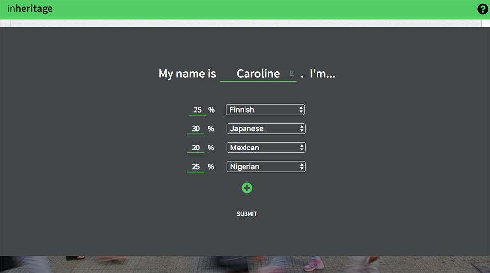
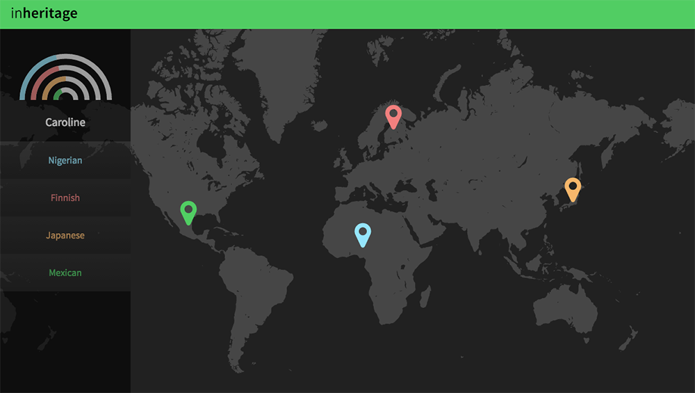
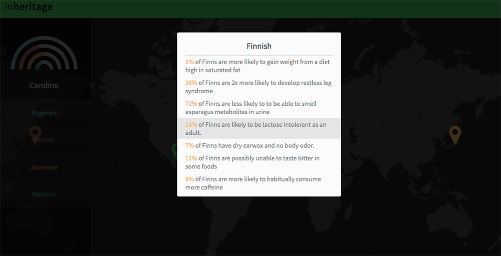
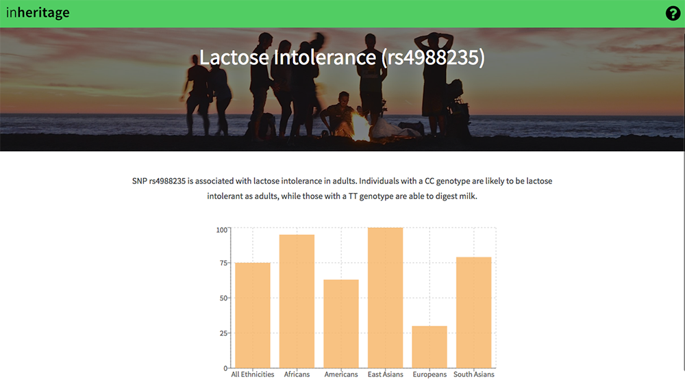

# Inheritage

[Inheritage Live][live_link]

<p align="center">
  
</p>

## Background
The 1000 Genome Project ran over a span of 7 years and resulted in the creation of the largest public database of human genetic information. Our project makes this information accessible to everyone in a fun and easy to understand way by displaying genetic statistics based on their heritage on an interactive map. Inheritage exclusively contain information on Single Nucleotide Polymorphisms (SNP), a common variance between different ethnicities.

This project incorporates a Django REST framework with a PostgreSQL database on the backend and a React.js with Redux framework on the frontend.

Below is a non exhaustive list of the technologies that were used in the creation of this application:

#### Frontend
- React
- React Router
- Redux
- Babel & Webpack
- Recharts for React
- Google Maps API

#### Backend
- Django
- Restless
- WhiteNoise

Please see the [docs][docs] folder for more information on the development of this project. The database was seeded with the help of [SNPedia][SNPedia] and [1000 Genomes][1000Genomes].

## Group Members
- [Chloe Chou](https://github.com/chloejchou)
- [Katarina Rossi](https://github.com/dischorde)
- [Lauren Madigan](https://github.com/lmadigan)
- [Bronwyn Dunn](https://github.com/bronwyndunn)


### Features and Implementation
After the user submits a list of up to 6 general `ethnicities`, they are brought to a `profile` displaying a world map.


<br><br>


 Each map marker reflects an ethnicity and reveals a modal includes all the associated SNP data for each ethnicity.



To fetch the appropriate statistics, we query the database for only the `data_points` belonging to specific `sub_populations` that fall underneath the umbrella of the submitted ethnicities

```python
# in models.py
class UserEthnicity(models.Model):
    def ethnicity_ids(self):
        return self.ethnicity.populations.all().values('id')

# in profiles.py
profile = Profile.objects.get(id=pk)
    ethnicity_set = profile.userethnicity_set.select_related('ethnicity').all()
    ethnicities = []

    for user_ethnicity in ethnicity_set:
        data_points = []
        eth_ids = user_ethnicity.ethnicity_ids()
        all_dps = DataPoint.objects.filter(sub_population_id__in=eth_ids).order_by('-sub_population__specific').select_related('snp', 'sub_population')
```

Clicking on a data point in the modal leads to a summary page, with a description of the SNP and a graph displaying the frequency of the highlighted genotype in the more general super-populations.




## Future Directions
- We plan to allow the user to create an account so that they are able to save their profile to view the next time they log in.
- We also plan to create a SNP index, so users can more easily navigate to each SNP detail page.

[docs]: /docs
[SNPedia]: http://snpedia.com/
[1000Genomes]: http://www.internationalgenome.org/
[live_link]: http://inheritage.herokuapp.com/
